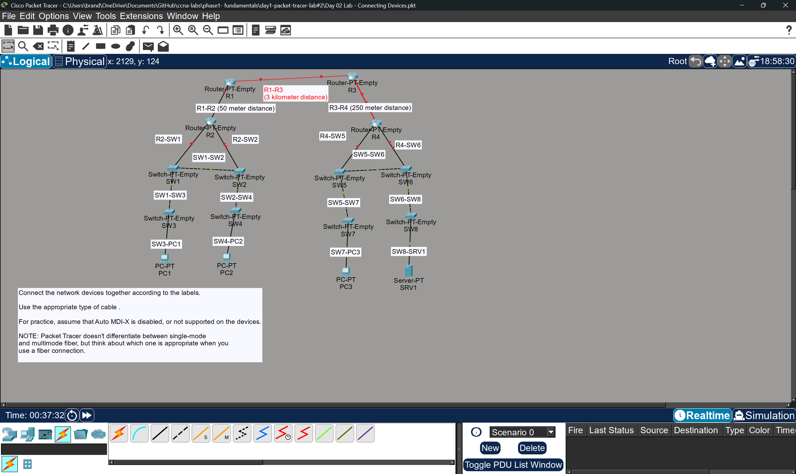

# Device Types and Cable Types Connections

## Objective
Connect devices to eachother with the correct cable type and port (Lab directly inspired from Jeremeys IT Lab)

## Topology

## Devices Used

- 4 Routers
- 8 Switches
- 3 PCs
- 1 Server

## Concepts Practiced

- Copper straight-through cables
- Copper crossover cables
- Fiber optic connections
- Router interfaces
- Switch interfaces
- PC network interfaces

## Key Decisions

- Used single-mode fiber optic cable between R1 and R3 because the distance was 3 kilometers.
- Selected appropriate interfaces when connecting routers, switches, PCs, and servers.
- Practiced identifying FastEthernet and GigabitEthernet ports.

## What I Learned

- Different cable types are used depending on the devices being connected.
- Fiber optic cables are preferred for longer distances.
- Routers, switches, PCs, and servers have different interface types.
- Packet Tracer requires selecting both the cable type and the physical interface.

## Files

- Day-02-Connecting-Devices.pkt
- topology.png